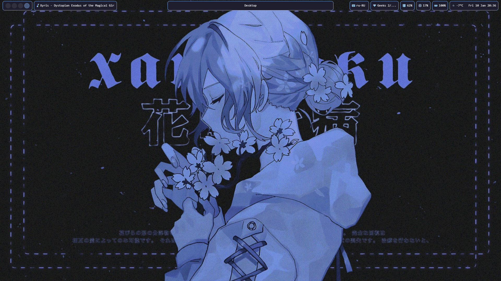
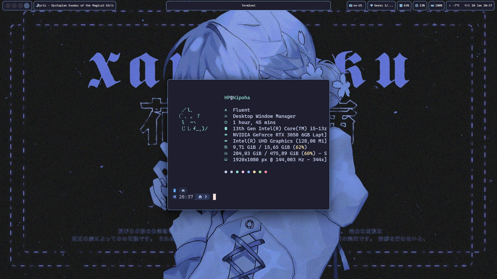
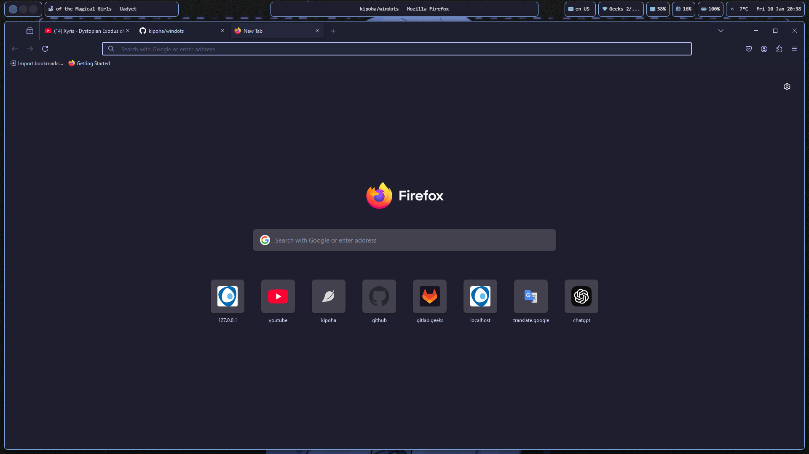
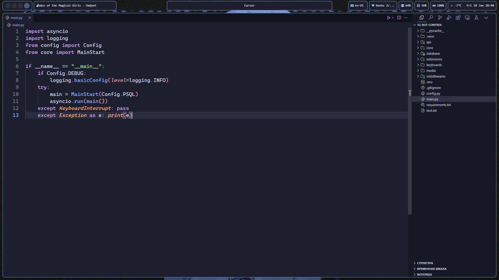
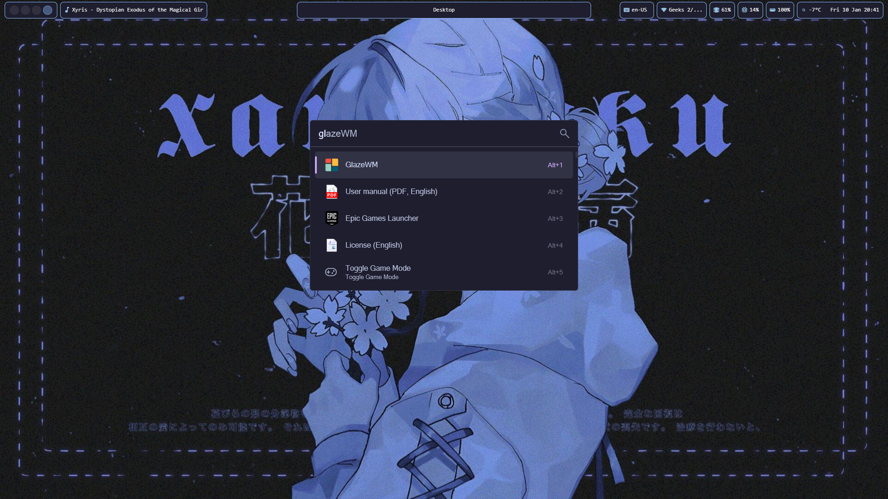

# Just Config

# Images






# System Info

- OS: [Windows 11 23H2](https://www.microsoft.com/en-in/windows/windows-11)
- File Manager: [File Exporer](https://www.microsoft.com/en-us/windows/tips/file-explorer)
- WM: [GlazeWM](https://github.com/glzr-io/glazewm)
- Shell: [PowerShell](https://learn.microsoft.com/en-us/powershell/)
- Terminal Emulator: [Windows Terminal](https://github.com/microsoft/terminal)
- Panel: [Zebar](https://github.com/glzr-io/zebar)
- Editor Code: [Cursor](https://www.cursor.com/)
- Browser: [Firefox](https://www.mozilla.org/en-US/firefox/)
- App Launcher: [Flow Launcher](https://www.flowlauncher.com/)
- Colorscheme: [Catppuccin Mocha](https://catppuccin.com/)

# Setup

> [!WARNING]  
> Before you start the setup, you need to install all the necessary programs!

### Font

Font: [Cascadia Code NF](https://github.com/microsoft/cascadia-code/releases)

### GlazeWM

Copy the `.config/glazewm/config.yaml` to your GlazeWM configuration directory `~/.glzr/glazewm/` and restart WM.

### Zebar

Copy the `.config/zebar/` to your Zebar configuration directory `~/.glzr/`

### Flow Launcher

Add theme `Catppuccin Mocha` to `~/AppData/Local/FlowLauncher/app-1.19.4/UserData/Themes/` from `.config/flowlauncher`

### Terminal

Paste `.config/terminal/settings.json` to your Terminal configuration `~/AppData/Local/Packages/Microsoft.WindowsTerminal_8wekyb3d8bbwe/LocalState/settings.json`

### FastFetch

1. Install fastfetch
```bash
winget install fastfetch
```

2. Copy the `.config/fastfetch/` to `~/.config/fastfetch/`

### Oh-My-Posh

1. Install oh-my-posh:
```bash
winget install JanDeDobbeleer.OhMyPosh -s winget
```
2. Open config file:
```bash
notepad $PROFILE
```

3. Copy the `.config/oh-my-posh/Moonlight.omp.json` to your pc

4. Paste code in `$PROFILE` file:
```txt
oh-my-posh init pwsh --config 'C:\Users\<username>\path_to_theme\Moonlight.omp.json' | Invoke-Expression
$env:VIRTUAL_ENV_DISABLE_PROMPT = 1
fastfetch
```

### VSCode / Cursor

Theme: [Catppuccin Theme](https://marketplace.visualstudio.com/items?itemName=Catppuccin.catppuccin-vsc)

Icons: [Catppuccin Icons](https://marketplace.visualstudio.com/items?itemName=thang-nm.catppuccin-perfect-icons)

Customize UI: [APC Customize UI](https://marketplace.visualstudio.com/items?itemName=drcika.apc-extension)

Copy the `.config/vscode/settings.json` to your VSCode/Cursor configuration `~/AppData/Roaming/Code/User/settings.json` or `~/AppData/Roaming/Cursor/User/settings.json`


### Firefox Theme

Theme: [Catppuccin Theme Minimal](https://addons.mozilla.org/en-US/firefox/addon/catppuccin-minimal/)